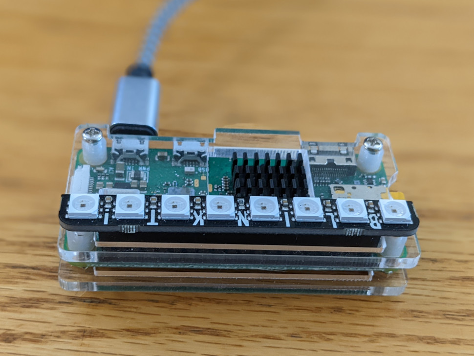

<p align="center">
 
</p>

<h1 align="center">belugasnooze pi client</h1>

<p align="center">
	A pi based wake up light sunrise alarm clock
</p>
<p align="center">
 The backend pi client that executes instructions from <a href='https://www.belugasnooze.com' target='_blank' rel='noopener noreferrer'>belugasnooze.com</a>, powered by <a href='https://www.staticpi.com' target='_blank' rel='noopener noreferrer'>staticPi.com</a>
</p>

<p align="center">
	Built in <a href='https://www.rust-lang.org/' target='_blank' rel='noopener noreferrer'>Rust</a>, with <a href='https://www.sqlite.org/' target='_blank' rel='noopener noreferrer'>SQLite</a>
	<br>
	<sub> See typescript branch for original, now not maintained, typescript version</sub>
</p>


## Required Hardware

1) Raspberry pi - designed for, tested, and fully working, a <a href='https://www.raspberrypi.com/products/raspberry-pi-zero-w/' target='_blank' rel='noopener noreferrer'>Raspbery pi zero w</a>
2) Pimoroni <a href='https://shop.pimoroni.com/products/blinkt' target='_blank' rel='noopener noreferrer'>Blintk!</a> led strip

<p align="center">
	<a href="https://raw.githubusercontent.com/mrjackwills/belugasnooze_pi/main/.github/pi_photo.jpg" target='_blank' rel='noopener noreferrer'>
		
	</a>
</p>

## Required software

1) <a href='https://www.docker.com/' target='_blank' rel='noopener noreferrer'>Docker</a> - container runner

Suggested locations for directories required by belugasnooze

| directory | reason|
| --- | --- |
|```~/belugasnooze/``` | Location of the node app |
|```/ramdrive```  | tmpfs ramdrive|

```bash
# addition to /etc/fstab
ramdrive /ramdrive tmpfs defaults,noatime,size=128K     0       0
```

Files that are required by belugasnooze
| file | reason|
|---|---|
|```./.env```		| enviromental variables |
|```ip.addr```		| ip address for private network |
|```alarms.db```	| database location |

suggested crontab

```bash
@reboot ip addr show wlan0 | grep -Po 'inet \K[\d.]+' > /ramdrive/ip.addr
* * * * * ip addr show wlan0 | grep -Po 'inet \K[\d.]+' > /ramdrive/ip.addr
```

ip address gets updated every 5 minutes, so write to a ramdrive rather than causing repetitive, eventually damaging, writes to the pi's SD card

## Download

See <a href="https://github.com/mrjackwills/belugasnooze_pi/releases" target='_blank' rel='noopener noreferrer'>releases</a>

download (armv6 one-liner)

```bash
wget https://www.github.com/mrjackwills/belugasnooze_pi/releases/latest/download/belugasnooze_linux_armv6.tar.gz &&
tar xzvf belugasnooze_linux_armv6.tar.gz belugasnooze
```

## Run

use ```./run.sh``` in order to start, stop, or rebuild, the docker container - requires dialog to be installed on your system

## Build step

### Raspberry pi

requires docker & <a href='https://github.com/cross-rs/cross' target='_blank' rel='noopener noreferrer'>cross-rs</a>

### 32bit pi (pi zero w)

Designed for, tested, and fully working, and originally built for pi zero w, running Raspberry Pi OS 32 bit

```cross build --target arm-unknown-linux-musleabihf --release```

### Untested on other platforms

## Tests

Some test coverage, needs work

run all;

```bash
cargo test -- --test-threads=1 --nocapture
```

Watch for test that start some_prefix;

```bash
cargo watch -q -c -w src/ -x 'test some_prefix_ -- --test-threads=1 --nocapture'
```

### Cargo watch

```bash
cargo watch -q -c -w src/ -x 'run'
```
